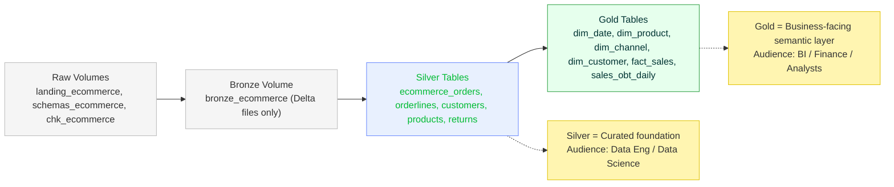

README - Retail Analytics Lakehouse (Azure)
# Retail Analytics Lakehouse (Azure)


**Stack:** Azure Data Factory · Azure Databricks · ADLS Gen2 · Delta Lake  
**Architecture:** Medallion (Bronze → Silver → Gold)  
**Transforms:** Bronze→Silver in **PySpark** (Auto Loader `availableNow`) · Silver→Gold in **Databricks SQL**  
**Model:** **Star Schema** (facts + dims) **+ One Big Table (OBT)**  
**Governance:** RBAC & ACLs on ADLS + Databricks grants (PII masked)

> **Goal:** Build a complete retail analytics pipeline on Azure. Automates daily ingestion of e-commerce data, transforms it using Medallion architecture, and delivers a governed Star Schema + One Big Table for BI and Finance teams.

---

## 🚀 Architecture




---

## 📂 Repository Map
```graphql
# main / develop branches
adf/
  factory/
    pipeline/
    dataset/
    linkedService/
    dataflow/
    trigger/
    factory/

databricks/
  notebooks/              # notebooks that your jobs run
  sql/                    # UC DDL & table constraints, grants, etc. (migration scripts)
  jobs/                   # optional: job specs (JSON/YAML) or DAB bundles

docs/
  architecture.md
  data_model.md
  security_rbac_acl.md

infra/
  storage_layout.md
  az_cli_bootstrap.md

data/
  seed/
    generate_orders.py

.github/
  workflows/
    ci.yml                # lint, basic checks, maybe dry-run SQL

# separate branch (not a folder in main)
(branch: adf_publish)
ARMTemplateForFactory.json
ARMTemplateParametersForFactory.json
```
---

## 🧭 What this project demonstrates

- **Incremental batch ingestion** with **Auto Loader** (`availableNow`)  
- **Idempotent Bronze→Silver** with schema inference, rescued records, dedupe, and PII masking  
- **SQL-only Silver→Gold** with:
  - Type-1 dimensions (Product, Channel)  
  - **SCD2** Customer dimension  
  - `fact_sales` (grain: order line)  
  - `sales_obt_daily` (denormalized One Big Table)  
- **Governance**: ADLS ACLs + Databricks GRANTs, masked views for PII  
- **CI/CD ready**: repo structured for GitHub Actions + Databricks Repos  
- **Portfolio polish**: documentation, diagrams, and screenshots for LinkedIn

---

## ⚙️ Quickstart

### Prereqs
Azure Subscription

ADLS Gen2 (Hierarchical namespace ON)

Azure Databricks workspace (with SQL Warehouse)

Azure Data Factory (linked to Storage + Databricks)

(Optional) Key Vault for secrets 

### 1) Storage layout (ADLS)

```
abfss://de-portfolio@newstoragegaurav.dfs.core.windows.net/
  landing/ecommerce/{orders,orderlines,customers,products,returns}/
  bronze/ecommerce/...        # raw Delta files (volume, not tables)
  silver/ecommerce/...        # curated external Delta tables
  chk/ecommerce/...           # checkpoints
  schemas/ecommerce/...       # schema inference

```

### 2) Seed data (optional)
Run:

```bash
python data/seed/generate_orders.py
```

This will generate small CSV/JSON test files into `landing/ecommerce/...`.

### 3) Bronze → Silver (PySpark, Databricks)
- Notebook `bronze_ingest_availableNow`: uses Auto Loader to ingest landing → bronze  
- Notebook `silver_transform`: cleans, deduplicates, hashes PII, writes to silver  

### 4) Silver → Gold (Databricks SQL)
Run `databricks/sql/ecom_gold_build.sql` to build:

- `dim_date`, `dim_product`, `dim_channel`  
- `dim_customer` (**SCD2**)  
- `fact_sales` (order line grain)  
- `sales_obt_daily` (OBT for self-serve analytics)

### 5) Orchestration (ADF)
Pipeline order:
1. Bronze ingest (PySpark Auto Loader, `availableNow`)  
2. Silver transform (PySpark)  
3. Gold build (SQL task)  

Add success/failure notifications for production-like monitoring.

---

## 🔐 Security (RBAC & ACL)

- **ADLS ACLs**
  - Engineers (`dg-ecom-de`): **rwx** on `/bronze`, `/silver`
  - Analysts (`dg-ecom-analyst`): **rx** on `/gold`

- **Databricks GRANTs**
  ```sql
    GRANT SELECT ON SCHEMA retail_analytics.gold.ecommerce.sales_obt_daily TO `dg-ecom-analyst`;
  

  ```
  Create **secure views** to expose `email_hash` instead of raw PII.

More detail in [`docs/security_rbac_acl.md`](docs/security_rbac_acl.md).

---

## 📊 Data Model (Gold)

**fact_sales**  
- Keys: `sk_date`, `sk_customer`, `sk_product`, `sk_channel`, (`order_id`, `order_line_id`)  
- Metrics: `qty`, `unit_price`, `discount_amt`, `tax_amt`, `net_sales_amt`  
- Audit: `load_dt`  

**dim_customer (SCD2)**  
- `(sk_customer, customer_id, email_hash, city, state, postal_code, effective_from, effective_to, is_current)`  

**OBT: `sales_obt_daily`**  
- Denormalized daily view with date, product category/brand, region, channel, and metrics  

See [`docs/data_model.md`](docs/data_model.md) for details.

---

## ✅ Continuous Integration (CI)

GitHub Actions workflow at `.github/workflows/ci.yml`:  

- Formats Python code with **Black** (PEP8 auto-formatter)  
- Runs optional unit tests (`pytest`)  
- Lints SQL scripts with **sqlfluff**  

Badge (add after CI is set up):


```


```

---

## 🖼️ Recommended Screenshots (for LinkedIn/docs)
 
- ADF pipeline (3 steps visible)  
- Databricks SQL task run showing successful MERGE  
- Table preview: `fact_sales` and `sales_obt_daily`  
- ADLS ACL configuration panel  

Save under `docs/images/` and embed in `docs/architecture.md`.

---


## 🔎 Project Status (Roadmap)

- [x] Stage 1: Repo scaffolding  
- [x] Stage 2: Azure foundation (ADLS, ADF, Databricks)  
- [x] Stage 3: RBAC/ACL  (ADLS only)
- [ ] Stage 4: Bronze→Silver (PySpark)  
- [ ] Stage 5: Silver→Gold (SQL)  
- [ ] Stage 6: CI (GitHub Actions)  
- [ ] Stage 7: CD (optional)  
- [ ] Stage 8: Docs & screenshots  

