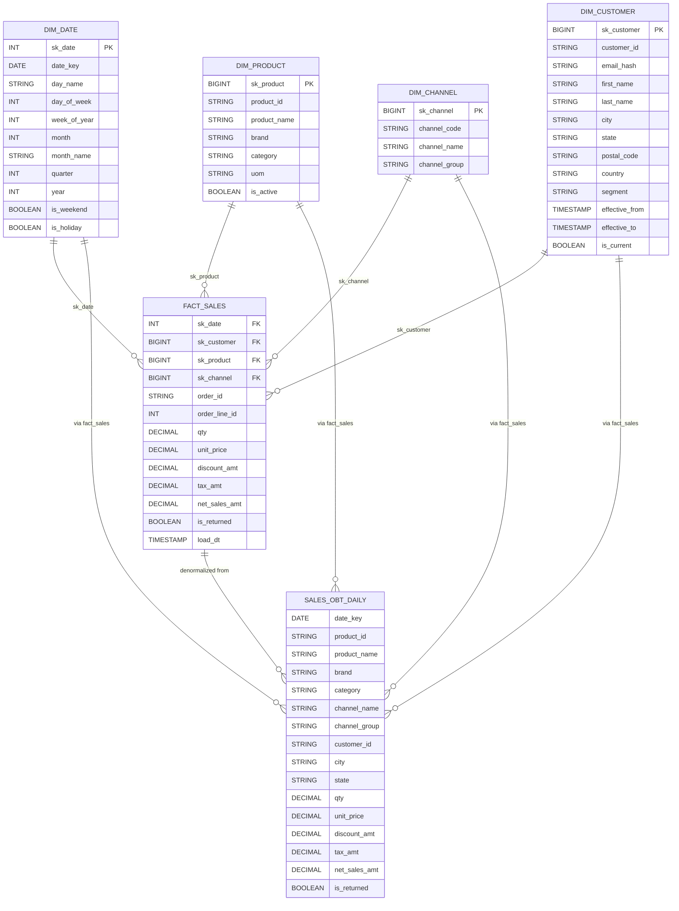

# Data Model – Retail Analytics (Silver → Gold)

> **Goal:** A governed, business-ready **Star Schema** fed from curated **Silver** tables, plus a **One Big Table (OBT)** for self-serve analytics.

- **Grain**
  - `fact_sales`: **order line** (one row per `order_id` × `order_line_id`)
  - `sales_obt_daily`: **daily, order line view** (denormalized for easy slicing)
- **Keys**
  - Surrogate keys in Gold: `sk_date`, `sk_customer`, `sk_product`, `sk_channel`
  - Natural keys live in Silver and are preserved in Gold for lineage
- **SCD**
  - `dim_customer`: **Type 2 (SCD2)** with `effective_from`, `effective_to`, `is_current`
  - Other dims: **Type 1**
- **Security**
  - PII handled in Silver (hash or null) and exposed via masked Gold views
- **Quality**
  - Not null & domain checks on keys, positive metrics, dedupe

---

## 1) Source-to-Model Lineage (Silver → Gold)

| Gold Object | Grain | Populated From (Silver) | Primary Join / Rule Summary |
|---|---|---|---|
| `dim_date` | Day | Derived calendar (no Silver dep) | Generate contiguous calendar, mark holidays/weekends |
| `dim_product` | Product | `ecommerce_products` | Conform product hierarchy (category/brand) |
| `dim_channel` | Channel | `ecommerce_orders` | Derive channel from order source |
| `dim_customer` (SCD2) | Customer version | `ecommerce_customers` | Hash/email masking, track changes over time |
| `fact_sales` | Order line | `ecommerce_orders`, `ecommerce_orderlines`, `ecommerce_returns` | 1 row per order line; amounts, taxes, discounts; return flags |
| `sales_obt_daily` | Daily OBT | `fact_sales` + all dims | Denormalized view for BI & ad-hoc |

---

## 2) Dimensions (Gold)

### 2.1 `dim_date` (Type 1)
**Grain:** one row per calendar day.

| Column | Type | Notes |
|---|---|---|
| `sk_date` | INT | `YYYYMMDD` |
| `date_key` | DATE | canonical date |
| `day_name`, `day_of_week`, `week_of_year` | INT/STRING | calendar attributes |
| `month`, `month_name`, `quarter`, `year` | INT/STRING | rollups |
| `is_weekend`, `is_holiday` | BOOLEAN | configurable holiday table |

> **Build hint:** generate via SQL calendar CTE; tag holidays using a config table.

---

### 2.2 `dim_product` (Type 1)
**Grain:** product.

| Column | Type | Notes |
|---|---|---|
| `sk_product` | BIGINT | surrogate (e.g., `xxhash64(product_id)`) |
| `product_id` | STRING | natural key from source |
| `product_name` | STRING |  |
| `brand` | STRING |  |
| `category` | STRING | normalized category |
| `uom` | STRING | unit of measure |
| `is_active` | BOOLEAN |  |

**Dedup rule:** last-write-wins by `load_dt` in Silver.

---

### 2.3 `dim_channel` (Type 1)
**Grain:** selling channel.

| Column | Type | Notes |
|---|---|---|
| `sk_channel` | BIGINT | surrogate |
| `channel_code` | STRING | e.g., `WEB`, `MARKETPLACE`, `STORE` |
| `channel_name` | STRING | Human-readable |
| `channel_group` | STRING | Optional grouping |

**Derivation:** from `ecommerce_orders.source_system` or mapping table.

---

### 2.4 `dim_customer` (Type 2, SCD2)
**Grain:** customer **version**.

| Column | Type | Notes |
|---|---|---|
| `sk_customer` | BIGINT | surrogate (stable per version) |
| `customer_id` | STRING | natural key |
| `email_hash` | STRING | PII masked |
| `first_name`, `last_name` | STRING | optional / masked |
| `city`, `state`, `postal_code`, `country` | STRING | standardized |
| `segment` | STRING | optional |
| `effective_from`, `effective_to` | TIMESTAMP | SCD2 range |
| `is_current` | BOOLEAN | 1 = active version |

**Change detection:** compare hashed attribute set vs prior; if changed → expire prior, insert new.

---

## 3) Fact (Gold)

### 3.1 `fact_sales` (order line grain)

| Column | Type | Notes |
|---|---|---|
| `sk_date` | INT | FK → `dim_date` |
| `sk_customer` | BIGINT | FK → `dim_customer` (current at order time) |
| `sk_product` | BIGINT | FK → `dim_product` |
| `sk_channel` | BIGINT | FK → `dim_channel` |
| `order_id` | STRING | natural key |
| `order_line_id` | INT | line n° |
| `qty` | DECIMAL(18,2) | ≥ 0 |
| `unit_price` | DECIMAL(18,2) | ≥ 0 |
| `discount_amt` | DECIMAL(18,2) | ≥ 0 |
| `tax_amt` | DECIMAL(18,2) | ≥ 0 |
| `net_sales_amt` | DECIMAL(18,2) | `(qty*unit_price) - discount_amt + tax_amt` |
| `is_returned` | BOOLEAN | from returns |
| `load_dt` | TIMESTAMP | ETL audit |

**Conformance rules**
- Null-safe joins to dims; send to a **rejects** table if keys missing (data quality alert)
- Enforce non-negative amounts (cap at 0) and coherent totals

---

## 4) One Big Table (OBT)

### 4.1 `sales_obt_daily`
**Purpose:** self-serve analytics without joins.

**Grain:** daily, order line view (repeatable aggregates at day level).

| Column | From | Notes |
|---|---|---|
| `date_key`, `year`, `quarter`, `month`, `week_of_year` | `dim_date` |  |
| `product_id`, `product_name`, `brand`, `category` | `dim_product` |  |
| `channel_name`, `channel_group` | `dim_channel` |  |
| `customer_id`, `city`, `state` | `dim_customer` | avoid PII |
| `qty`, `unit_price`, `discount_amt`, `tax_amt`, `net_sales_amt`, `is_returned` | `fact_sales` |  |

> **Implementation:** CTAS from `fact_sales` + dims; optionally **materialize as a view** first, table later if performance requires.

---

## 5) Keys, Surrogates & Hashing

- **Surrogate keys (BIGINT)**
  - Use deterministic hashes for dimension SKs when natural keys are stable:
    - `sk_product = xxhash64(product_id)`
    - `sk_channel = xxhash64(coalesce(channel_code, channel_name))`
  - `sk_customer` is per **version**; compute over a stable tuple (e.g., `customer_id || city || state || postal_code || segment`)
- **PII**
  - `email_hash = sha2(lower(trim(email)), 256)`
- **Date SK**
  - `sk_date = year(date_key)*10000 + month(date_key)*100 + day(date_key)`

---

## 6) Partitioning & Performance (Databricks)

- **Silver** external tables:
  - Partition where beneficial (e.g., `orders` by `order_date`), and **OPTIMIZE ZORDER** on frequent predicates (e.g., `order_id`, `customer_id`)
- **Gold** managed tables:
  - `fact_sales`: consider **ZORDER** on `sk_date`, `sk_product`, `sk_customer`
  - `sales_obt_daily`: ZORDER on `date_key`, `category`, `channel_name`
- **Vacuum**: follow retention policy (e.g., 7 days) after MERGE/DELETE

---

## 7) Quality & Validation

- **Not Null**: SKs, `order_id`, `order_line_id`, `qty`, `unit_price`
- **Domain**: `qty ≥ 0`, amounts ≥ 0
- **Uniqueness**: (`order_id`, `order_line_id`) in `fact_sales`
- **Referential checks**: unmatched FKs route to `_rejects` with reason
- **Row counts**: Silver → Gold reconciliation (e.g., lines within expected delta)

---

## 8) Example Build Skeletons (Databricks SQL)

### 8.1 `dim_product` (Type 1 upsert)
```sql
MERGE INTO retail_analytics.gold.dim_product d
USING (
  SELECT DISTINCT
    xxhash64(product_id) AS sk_product,
    product_id,
    product_name,
    brand,
    category,
    uom
  FROM retail_analytics.silver.ecommerce_products
) s
ON d.product_id = s.product_id
WHEN MATCHED THEN UPDATE SET *
WHEN NOT MATCHED THEN INSERT *;
```

### 8.2 `dim_customer` (SCD2)
```sql
-- Identify changing attributes (excluding natural key)
WITH src AS (
  SELECT
    customer_id,
    sha2(lower(trim(email)), 256) AS email_hash,
    city, state, postal_code, segment
  FROM retail_analytics.silver.ecommerce_customers
),
chg AS (
  SELECT s.*,
         xxhash64(customer_id, email_hash, city, state, postal_code, segment) AS attr_hash
  FROM src s
)
-- Close current records where attributes changed
MERGE INTO retail_analytics.gold.dim_customer d
USING chg s
ON d.customer_id = s.customer_id AND d.is_current = TRUE
WHEN MATCHED AND xxhash64(d.customer_id, d.email_hash, d.city, d.state, d.postal_code, d.segment) <> s.attr_hash
  THEN UPDATE SET d.is_current = FALSE, d.effective_to = current_timestamp()
WHEN NOT MATCHED
  THEN INSERT (
    sk_customer, customer_id, email_hash, city, state, postal_code, segment,
    effective_from, effective_to, is_current
  ) VALUES (
    xxhash64(s.customer_id, s.attr_hash), s.customer_id, s.email_hash, s.city, s.state, s.postal_code, s.segment,
    current_timestamp(), TIMESTAMP '9999-12-31 00:00:00', TRUE
  );
```

### 8.3 `fact_sales`
```sql
CREATE OR REPLACE TABLE retail_analytics.gold.fact_sales AS
SELECT
  d.sk_date,
  c.sk_customer,
  p.sk_product,
  ch.sk_channel,
  ol.order_id,
  ol.order_line_id,
  ol.qty,
  ol.unit_price,
  coalesce(ol.discount_amt, 0) AS discount_amt,
  coalesce(ol.tax_amt, 0)       AS tax_amt,
  (ol.qty * ol.unit_price) - coalesce(ol.discount_amt,0) + coalesce(ol.tax_amt,0) AS net_sales_amt,
  CASE WHEN r.order_id IS NOT NULL THEN TRUE ELSE FALSE END AS is_returned,
  current_timestamp() AS load_dt
FROM retail_analytics.silver.ecommerce_orderlines ol
JOIN retail_analytics.silver.ecommerce_orders o
  ON o.order_id = ol.order_id
LEFT JOIN retail_analytics.silver.ecommerce_returns r
  ON r.order_id = ol.order_id AND r.order_line_id = ol.order_line_id
JOIN retail_analytics.gold.dim_product p
  ON p.product_id = ol.product_id
JOIN retail_analytics.gold.dim_channel ch
  ON ch.channel_code = o.channel_code
JOIN retail_analytics.gold.dim_customer c
  ON c.customer_id = o.customer_id AND c.is_current = TRUE
JOIN retail_analytics.gold.dim_date d
  ON d.date_key = CAST(o.order_date AS DATE);
```

### 8.4 `sales_obt_daily`
```sql
CREATE OR REPLACE TABLE retail_analytics.gold.sales_obt_daily AS
SELECT
  dt.date_key, dt.year, dt.quarter, dt.month, dt.week_of_year, dt.day_name,
  p.product_id, p.product_name, p.brand, p.category,
  ch.channel_name, ch.channel_group,
  c.customer_id, c.city, c.state,
  f.qty, f.unit_price, f.discount_amt, f.tax_amt, f.net_sales_amt, f.is_returned
FROM retail_analytics.gold.fact_sales f
JOIN retail_analytics.gold.dim_date dt     ON dt.sk_date = f.sk_date
JOIN retail_analytics.gold.dim_product p   ON p.sk_product = f.sk_product
JOIN retail_analytics.gold.dim_channel ch  ON ch.sk_channel = f.sk_channel
JOIN retail_analytics.gold.dim_customer c  ON c.sk_customer = f.sk_customer;
```

---

## 9) Naming & Conventions

- Tables: `dim_*`, `fact_*`, `*_obt*`, `ecommerce_*` (Silver)
- Surrogates: `sk_*`
- Timestamps: `*_dt` (load, effective)
- Booleans: `is_*`
- Keep column names **lower_snake_case**

---

## 10) Open Decisions / Extensions

- Add **promo/price** snapshot fact if available
- Add **inventory** fact for supply metrics
- Introduce **conformed dims** if more domains join (e.g., `dim_geography`)
- Optional **semantic model** (Power BI) on top of Gold

---

## 11) ERD (Mermaid)


